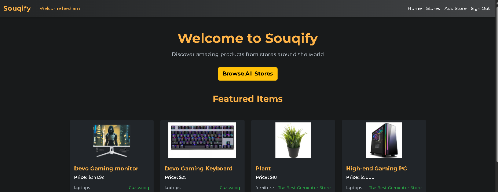
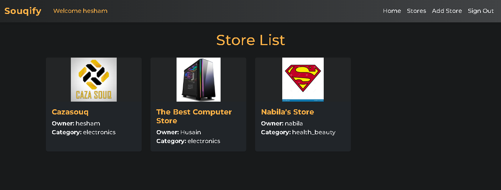
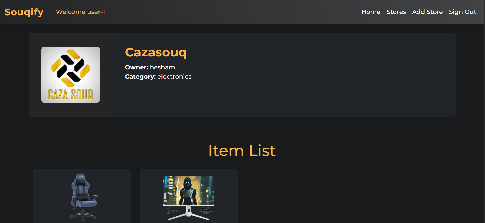
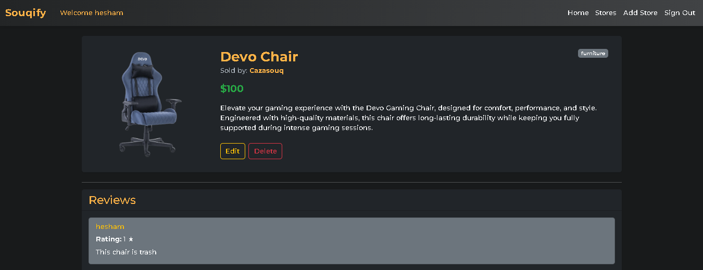
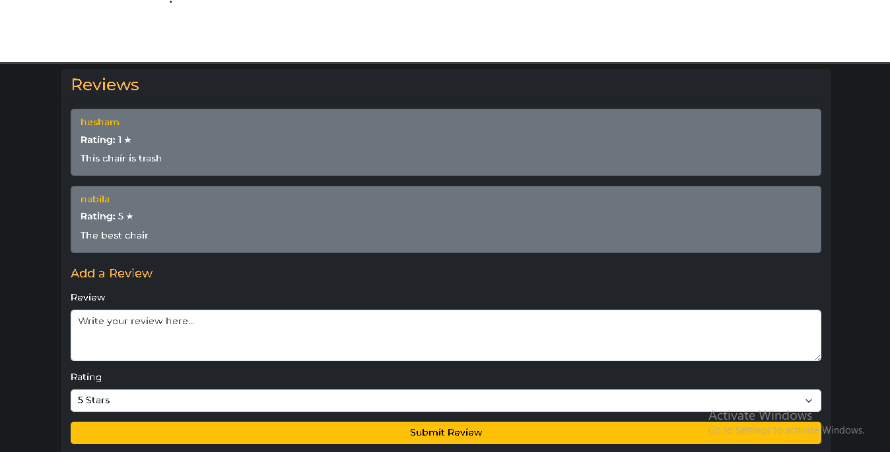

# 🛍️ Souqify

## 📝 Project Description

**Souqify** is a marketplace web application where users can create their own stores, add products, and interact with other sellers.  
Each store can have multiple items, and any signed-in user can leave reviews on items.  
We built Souqify to provide a collaborative, community-driven online shopping experience.

This project was developed as part of a **MERN Stack full-stack development requirement**:

- **Frontend:** React for a dynamic, interactive UI.
- **Backend:** Node.js with Express for server-side functionality.
- **Database:** MongoDB with Mongoose for data storage and management.
- **Authentication & Authorization:** Implemented on both frontend and backend using JWT.
- **CRUD Operations:** Full create, read, update, and delete functionality for users, stores, items, and reviews.
- **Deployment:** Frontend deployed to **Vercel**, backend deployed to **Heroku**.
- **Planning:** Created ERD, user stories, and wireframes before development.

## 🚀 Getting Started

### 🌐 Live Demo
- **Check it here:** [Souqify Live App](https://react-souqify-front-end.vercel.app/)  

### 📋 Planning Materials
- [Plainning Docs](https://trello.com/b/RacBmZJ6/unite-3-project)

### 🗄️ Back-End Repository
- [Souqify Back-End](https://github.com/Hesham243/express-api-souqify-back-end.git)

### How to Use
1. **Sign up** or **Sign in** to your account.
2. Create one or more stores.
3. Add items to your store with descriptions, prices, and images.
4. Browse other users’ stores and view their items.
5. Click on an item to see details and read comments.
6. Leave a comment on any item if you are signed in.

## ✨ Features

- User authentication with **Sign Up / Sign In**.
- **Create, update, and delete stores**.
- **Add, edit, and remove items** with descriptions, prices, and images.
- **View other users’ stores** and browse their products.
- **Item details page** with reviews and ratings.
- **Leave reviews/comments** on any item (if signed in).
- **Responsive design** compatible with desktop and mobile devices.
- Planned features: checkout/payment flow, search & filtering, user profile page.

## 🖼️ Screenshots

### Home Page

### Store Page

### Store Details Page

### Item Details & Reviews

*These visuals showcase the core functionality of Souqify, including store creation, item listing, and commenting.*

## 💡 Technologies Used

- **Frontend:** React, React Router
- **Backend:** Node.js, Express
- **Database:** MongoDB + Mongoose
- **Authentication:** JWT
- **Styling:** React-Bootstrap

## 📚 Attributions
- [Montserrat Font](https://fonts.googleapis.com/css2?family=Montserrat:wght@500;700&display=swap)

## 🚧 Next Steps

- Implement checkout and payment flow
- Add search and filtering functionality
- Enable product image uploads
- Add user profile page

## 👥 Contributors

| Name          | Role                        | GitHub Profile                                    |
|---------------|-----------------------------|-------------------------------------------------- |
| Hesham Ahmed  | Full Stack Developer / Lead | [Hesham243](https://github.com/Hesham243)         |
| Husain Nabeel | Full Stack Developer / Lead | [Halsehlawy](https://github.com/Halsehlawy)       |
| Sara Jaffar   | Full Stack Developer        | [sara-jaffar](https://github.com/sara-jaffar)     |
| Mohammed Al-Rashed| Full Stack Developer    | [MnM622803](https://github.com/MnM622803)         |
